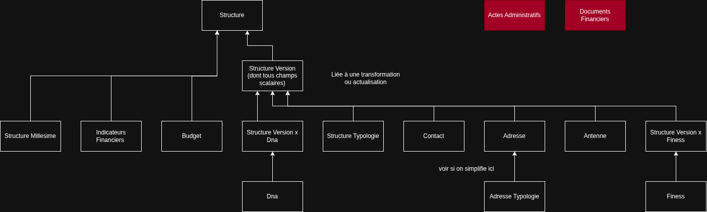

# Versionnage des champs d'une structure (StructureMillesime / StructureVersion)

Document de réflexion sur la modélisation de l'état d'une structure dans le temps, en lien avec les **transformations** et les actualisations à venir.

- [Versionnage des champs d'une structure (StructureMillesime / StructureVersion)](#versionnage-des-champs-dune-structure-structuremillesime--structureversion)
  - [Contexte](#contexte)
  - [Règles métier retenues](#règles-métier-retenues)
  - [Option retenue](#option-retenue)
    - [Option B - Rolling timestamp + versions sauvegardées \[PRIVILÉGIÉE À CE STADE\]](#option-b---rolling-timestamp--versions-sauvegardées-privilégiée-à-ce-stade)
      - [Principe](#principe)
      - [Avantages](#avantages)
      - [Inconvénients](#inconvénients)
  - [Tables concernées](#tables-concernées)
    - [Coquille `Structure`](#coquille-structure)
    - [Conteneur de version](#conteneur-de-version)
    - [Tables métier à lier à `StructureVersion`](#tables-métier-à-lier-à-structureversion)
    - [Tables métier à lier à `StructureMillesime`](#tables-métier-à-lier-à-structuremillesime)
    - [Interrogations restantes](#interrogations-restantes)
    - [StructureDna](#structuredna)
    - [Reporting (vues SQL)](#reporting-vues-sql)
    - [Non concerné par le chantier](#non-concerné-par-le-chantier)
      - [DNA et données rattachées au code DNA (indirect)](#dna-et-données-rattachées-au-code-dna-indirect)
      - [CPOM](#cpom)
      - [Tables liées directement à la structure, plus "intéropérables"](#tables-liées-directement-à-la-structure-plus-intéropérables)
      - [Tables moins en lien de toute façon avec Structure](#tables-moins-en-lien-de-toute-façon-avec-structure)
      - [Fichiers](#fichiers)
  - [Questions ouvertes](#questions-ouvertes)
  - [Prochaines étapes](#prochaines-étapes)
- [\[Old\] Options non retenues](#old-options-non-retenues)
  - [Option A - Millésime complet à chaque version](#option-a---millésime-complet-à-chaque-version)
    - [Principe](#principe-1)
    - [Avantages](#avantages-1)
    - [Inconvénients](#inconvénients-1)
  - [Option C - Table de passage (copy-on-write / liens)](#option-c---table-de-passage-copy-on-write--liens)
    - [Principe](#principe-2)
    - [Avantages](#avantages-2)
    - [Inconvénients](#inconvénients-2)
  - [Option D - Millésime partiel à chaque update](#option-d---millésime-partiel-à-chaque-update)
    - [Principe](#principe-3)
    - [Avantages](#avantages-3)
    - [Inconvénients](#inconvénients-3)
  - [Option E - Application différée par cron](#option-e---application-différée-par-cron)
    - [Principe](#principe-4)
    - [Avantages](#avantages-4)
    - [Inconvénients](#inconvénients-4)

## Contexte

La question se pose initialement dans le cadre des transformations : on veut pouvoir dans le cadre de ces transfos modifier un certain nombre de champs et tables de la structure avec une prise d'effet ultérieure (à date de transformation). Cela entraîne alors une réflexion globale sur la manière de gérer ces évolutions.

Une structure peut en réalité évoluer pour plusieurs raisons :

- **Transformation** validée (fermeture, extension, transfert de places entre structures, etc.) à une date d'effet potentiellement **future** ;
- **Modification courante** (fiche structure, campagne d'actualisation, correction opérateur…) ;
- **Campagne d'actualisation** selon une logique à venir, à des moments spécifiques de l'année.

Historiquement, beaucoup de données sont rattachées directement à `Structure`, avec des millésimes partiels (`StructureMillesime`, `StructureTypologie` par **année**).

Je pense que l'on a confondu jusque là deux notions qu'il faut reséparer.

- `StructureMillesime` est à conserver en tant que tel : il est associé à une année, est immuable. Il concerne les indicateurs de la structure sur une certaine année, indépendamment de ce qu'a vécu la structure (transfos ou pas). Il s'agit essentiellement à date des indicateurs financiers et du budget.
- `StructureVersion` doit lui devenir une table liée à `Structure` qui reprend quasiment l'ensemble des champs scalaires et tables liées actuellement à `Structure`. C'est elle qui va porter l'historique et le futur + le "rolling timestamp".

Objectif : **`Structure` = coquille stable** (id intéropérable et code Bhasile essentiellement) ; **état métier variable = version datée**.

À noter : il a été envisagé de profiter de la refacto pour lier `Budget`, `IndicateursFinanciers` à `StructureMillesime` et standardiser le principe de table de passage. Néanmoins la table `Budget` peut aussi être liée à `Cpom` qui lui ne possède pas de table de millésime. Cela rend donc la présence d'un `year` encore obligatoire sur le `Budget` et rend la migration moins appropriée.

## Règles métier retenues

- **Brouillon transfo ou actualisation** : Les données ne vivent que dans `Transformation` + `StructureTransformation` (et leurs enfants).
- **Validation transfo ou actualisation** : Gérée via le **`Form.status`** lié à la transformation (`Form.transformationId`, bouton « Finaliser »). Une fois validée, la transfo **ne bouge plus**.
- **Application structure** : À la validation : pour chaque `StructureTransformation`, création d'une version datée de `StructureVersion` sur la structure à `StructureTransformation.date`.
- **Affichage** : Dernière version avec `effectiveDate ≤ date du jour`. Si version future existante on affiche un bandeau sur la fiche.
- **Résolution** : Gérée en back

---

## Option retenue

Une option de modélisation a été retenue, les autres sont à retrouver en fin de document pour plus de clarté.

### Option B - Rolling timestamp + versions sauvegardées [PRIVILÉGIÉE À CE STADE]

#### Principe

- **Un seul** état « courant » mutable (**rolling**), qui reflète la réalité aujourd'hui.
- Chaque structure a un `StructureVersion` spécifique correspondant à ce rolling (flag ? absence de transformationId / actualisationId ?)
- Les **opérations sauvegardées** (transfo validée à date ultérieure ou non, idem sur les actualisations) sont stockées à part ; tant qu'elles ne sont pas effectives, elles n'alimentent pas le rolling.
- Quand la date passe : par défaut l'app affiche l'opération, si l'utilisateur modifie ça vient modifier le rolling détcté
- Option de **conserver** certains jalons (transfo, campagne) comme versions nommées.

Les tables liées pointent soit vers le rolling, soit vers des versions sauvegardées

#### Avantages

- **Léger** au quotidien : une correction ne duplique pas 15 tables.
- On conserve un historique léger sur des points d'étape nommés, et on est capable de gérer un "état du quotidien"

#### Inconvénients

- **Historique un peu plus faible** si on écrase le rolling : impossible de répondre à « quelle était la fiche le 12 mars ? » sauf à revenir à la dernière version explicite. Cependant cela ne semble pas être une demande métier

---

## Tables concernées

Le schéma serait le suivant (voir détails ci dessous)

### Coquille `Structure`

- **`Structure`** - identité stable :
  - `id`,
  - `codeBhasile`,
  - `filiale?` -> Modification à venir non liée à ce chantier
  - `createdAt` / `updatedAt`

### Conteneur de version

- **`StructureVersion`** - entité centrale
  - `effectiveDate`,
  - `structureId`,
  - `slug?`,
  - `shouldHistorize`,
  - `transformationId?`,
  - `actualisationId?`,
  - **Champs scalaires aujourd’hui sur `Structure`** - à migrer dans la version :
    - `type`, `nom`, `public`
    - `operateurId` (à vérifier, si l'on souhaite que la structure puisse changer d'opérateur)
    - `adresseAdministrative`, `codePostalAdministratif`, `communeAdministrative`, `departementAdministratif`
    - `latitude`, `longitude`
    - `debutConvention`, `finConvention`, `creationDate`, `date303`, `debutPeriodeAutorisation`, `finPeriodeAutorisation` -> Dépréciation à venir via autre chantier pour passer par les dates des actes administratifs ? Migrés dans cette table en attendant
    - `lgbt`, `fvvTeh` -> autre chantier possible (hors de celui-ci): aligner le type avec typologie
    - `nomOfii`, `directionTerritoriale`, `notes`
    - `isArchived`

### Tables métier à lier à `StructureVersion`

- **`StructureTypologie`** -> passer le year actuel à un timestamp (mais voir si au fond ça a du sens côté métier) : valider que l'évolution est maintenant liée à un timestamp, que ce soit via une transfo ou une campagne d'actualisation, et plus une année à proprement parler
- **`Contact`**
- **`Adresse`** - `placesAutorisees`, `qpv`, `logementSocial` (ex `AdresseTypologie`)
- **`Antenne`**
- **`Finess`** - gérer les `unique` sur le code Finess (dans ce cas via une table de passage)
- **`DnaStructure`** - cf paragraphe spécifique en dessous.

### Tables métier à lier à `StructureMillesime`

À la différence des tables précédentes, ces tables sont liées à une "année" et ne sont pas impactée par un "changement de version de la structure".
Actuellement la table ne contient que les champs `cpom` et `operateurComment` qui doivent faire l'objet d'un récolement propre avec les Cpoms dédiés (voir que faire des commentaires, si possible avec la nouvelle table `Notes`)

- **`Budget`** - budgets structure (hors budget CPOM pur)
- **`IndicateurFinancier`** - ETP, taux d’encadrement, coût journalier (par `year` + `type`)

### Interrogations restantes

- **`ActeAdministratif`** - plutôt événementiel (`date`, `startDate`, `endDate`) -> Liés soit à une structure, soit à une structure transformation.
- **`DocumentFinancier`** - documents financiers structure

### StructureDna

Veut-on uniformiser le traitement avec le rattachement d'une structure à ses DNA ?
Pour le coup il semble indispensable que les DNA associés à une structure soit gérés dans le cadre des transfos (c'est dans ce cas qu'on verra des changements).

À noter : **`startDate` / `endDate`** sont donc dépréciés au profit de l’`effectiveDate` de la version où le lien apparaît ou disparaît. Ceci étant dit on a 0 entrée avec un de ces champs rempli à date donc la migration devrait être facile.

Je propose donc de gérer le lien d'une structure avec ses DNA en passant par la table de passage `StructureVersion`

### Reporting (vues SQL)

- **`ComparaisonPlaces`** (vue `reporting`)
- **`StructuresAggregates`** (vue `reporting`)
- **`StructuresFilling`** (vue `reporting`)

-> À adapter pour joindre la **dernière version passée** plutôt que `Structure` directement.

### Non concerné par le chantier

#### DNA et données rattachées au code DNA (indirect)

- **`Dna`** - référentiel hors périmètre (le lien change via `DnaStructure`, cf au dessus)
- **`Activite`** - via `dnaCode`, pas `structureId`
- **`EvenementIndesirableGrave`** - via `dnaCode`

#### CPOM

Veut-on uniformiser le traitement avec le rattachement d'une structure à ses CPOM ?

- **`CpomStructure`** - appartenance structure x CPOM (`dateStart` / `dateEnd`)
- **`CpomMillesime`** - millésime **CPOM** (pas structure) : hors périmètre

-> Plutôt non, il s'agit d'un chantier bien à part. Le comportement des CPOM et leur rattachement à une structure reste donc inchangé.

#### Tables liées directement à la structure, plus "intéropérables"

- **`Controle`** (+ **`FileUpload`** liés)
- **`Evaluation`** (+ **`FileUpload`** liés)
- **`Note`** (`userNotes`)

#### Tables moins en lien de toute façon avec Structure

- **`Form`** / **`FormStep`** / **`FormDefinition`** / **`FormStepDefinition`**
- **`Campaign`** - Inutilisée pour le moment de toute façon, usage à venir avec les actualisations ?
- **`UserAction`** / **`User`** / **`Role`** - référentiels auth

#### Fichiers

- **`FileUpload`** - reste rattaché à l’entité parente (`ActeAdministratif`, `DocumentFinancier`, `Controle`, `Evaluation`) ; pas de FK directe structure (on remercie la refacto passée)

---

## Questions ouvertes

- [ ] Valider qu'une structure ne peut pas avoir **plusieures** versions le même jour (deux transfo) ? Gérer aussi le cas rolling version manuelle le jour d'une transfo
- [ ] Gestion des unique (Codes Finess par exemple). Veut-on conserver un principe d'unicité du code Finess ? Si oui par cohérence profitons-en pour "clean" la string rentrée par l'utilisateur (que des chiffres sans espace)
- [ ] Exemple de **AdresseTypologie** : en a-t-on vraiment besoin d'ailleurs côté métier ? Ou peut-on considérer que le seul moment où on gèrera ces adresses ce sera via les transfos (et éventuellement les campagnes d'actualisation) mais qu'on ne veut pas conserver d'historique annualisé par exemple ?
- [ ] Actes administratifs ?
  - [ ] Début convention / fin convention est censé à un moment prendre le dessus sur les champs scalaires (cf discussion en cours où ~ 50% des entrées ne matchent pas) : où en est-on
  - [ ] Que veut-on faire des actes administratifs liés à la transfo ? Où se retrouvent les "arrêtés actant la contraction" et "autres documents" ? Dans ce cas que fait-on de la convention, on affiche les deux ? Veut-on pouvoir les modifier a posteriori ? Quelle interface ?
- [ ] Changement d'opérateur : veut-on en faire une transfo (même hors formulaire) ? Dans tous les cas on aura moyen de gérer une sorte d'historique maintenant, à voir si on veut le rendre visible et en faire un type de transfo à part.

---

## Prochaines étapes

- [ ] Création d'une branche avec premeir changement de schéma hors transfo et d'un script de migration idempotent et PR sur dev puis main
- [ ] On joue le script idempotent une première fois, puis juste avant merge final
- [ ] Rebase de migration (qui contient notamment la partie de schema transformation)
- [ ] Fin de dev de la partie transfo sur migration, passage sur dev puis main
- [ ] On rejoue le script idempotent
- [ ] Cleaning des anciens liens entre `Structure` et ses différentes tables

---

# [Old] Options non retenues

## Option A - Millésime complet à chaque version

### Principe

Chaque événement qui « fige » un nouvel état crée un **`StructureMillesime`** (ou `StructureTimestamp`) avec une **`effectiveDate`**, et **duplique toutes les lignes** des tables liées (contacts, adresses, typologies, budgets…).

Deux déclencheurs typiques :

1. **Validation d'une transformation ou actualisation** -> nouveau millésime à la date d'effet (passée ou future).
2. **Modification hors transfo** -> nouveau millésime à date + copie intégrale.

Tant que `effectiveDate > now`, l'app n'applique pas cet état à l'affichage courant ; la fiche utilise le dernier millésime passé.

### Avantages

- Modèle **simple à expliquer** : un millésime = photo complète à la date D.
- Requêtes **simples** : sans résolution de graphe.
- **Historique fidèle** : on peut toujours reconstituer l'état à une date (si on a gardé les millésimes).
- Aligné avec la validation transfo (copie depuis `StructureTransformation` vers un millésime structure).

### Inconvénients

- **Volume** : beaucoup de lignes recopiées sans changement (2 contacts identiques dupliqués n fois).
- Coût **écriture** à chaque petite modification (correction téléphone -> copie de tout).
- Niveau "db" la compréhension métier est peu satisfaisante, aucun sens de dupliquer des contacts n fois. Par ailleurs des contraintes d'uniticté (sur un code Finess par exemple) sont à gérer

---

## Option C - Table de passage (copy-on-write / liens)

### Principe

Les entités métier (**Contact**, **Adresse**…) restent des lignes identifiées ; on crée une table de passage entre chaque Table et `StructureMillesime` la version datée ne duplique que des liens :

- `StructureMillesime` (effectiveDate, structureId, …)
- `ContactStructureMillesime` (timestampId, contactId, …)

**Règle copy-on-write** :

- Si le contact **ne change pas** entre millésime M1 et M2 -> **même** `contactId`, nouveau lien vers M2.
- Si le contact **change** -> nouvelle ligne `Contact` + lien vers M2.
- Même idée pour adresses, typologies, etc.

C'est un modèle de **versioning par entité**, pas par millésime global.

### Avantages

- **Stockage optimisé** : pas de duplication des entités inchangées.
- Historique **réel** des entités modifiées (chaîne de versions de Contact).
- Identité stable d'un contact « métier » possible (même personne au travers des différentes versions).

### Inconvénients

- **Complexité algorithmique** : actuellement l'update d'un champ vient actualiser l'intégralité de `Structure` et des tables liées, la modification est donc majeure et faire reprendre tous nos `PUT`.
- **Suppressions** difficiles (contact retiré à M2 : lien absent vs contact supprimé ?).
- **Collections** (liste de 12 adresses dont 1 seule change) : beaucoup de tables de passage.
- On mutliplie la cmplexité des requêtes prisma avec de nombreux structure.structureMillesime.structureMillesimeContact.contact : repositories et seeds **beaucoup** plus lourds à maintenir.

---

## Option D - Millésime partiel à chaque update

### Principe

À chaque modification (hors brouillon transfo), on crée un nouveau **`StructureMillesime`** à la date du changement, mais on ne persiste que **le périmètre envoyé par le client** dans le `PUT` / le formulaire — pas une copie systématique de toutes les tables liées.

**Aujourd'hui** (payload « large ») : si l'utilisateur ne modifie que le Finess, le body contient quand même contacts, adresses, typologies, etc. Le back recrée un millésime avec tout ce bloc → on duplique les contacts même sans changement métier, mais on ne touche pas au budget ni aux autres tables annualisées absentes du payload.

**À terme** (payload « delta ») : les formulaires ne renvoient que les entités modifiées ; le millésime ne contient que ces lignes + les champs scalaires mis à jour. Les tables non envoyées restent celles du **millésime précédent** à la lecture (fusion du dernier état connu par collection).

Même règles d'affichage que les autres options : `effectiveDate ≤ aujourd'hui` pour l'état courant ; millésime futur (ex. transfo validée) → bandeau.

### Avantages

- **Compromis** entre l'option A (tout dupliquer) et B/C : historique par jalons sans copier 15 tables à chaque fois si le client n'envoie pas tout.
- **Aligné avec l'existant** : les `PUT` structure envoient déjà un arbre partiel ; pas de refonte copy-on-write immédiate.
- **Évolutif** : en resserrant les payloads, on réduit le volume sans changer le modèle de données.
- Les tables **annualisées** (budget, indicateurs) peuvent rester hors millésime tant qu'elles ne sont pas dans le body.

### Inconvénients

- **Lecture plus complexe** qu'en option A : pour afficher la fiche, il faut **recomposer** l'état (dernier millésime passé + pour chaque collection, dernier millésime qui a porté une ligne sur cette table — ou héritage explicite du millésime N-1).
- **Millésimes « incomplets »** en base : ambiguïté si on oublie d'envoyer une collection (bug ou régression → données qui semblent disparaître).
- Tant que les formulaires envoient tout le bloc identification / contacts, on garde une partie du **sur-duplication** de l'option A.
- **Validation transfo** : à définir (snapshot complet depuis `StructureTransformation` à la validation, ou même logique partielle).
- Tests et seeds plus difficiles qu'avec « un millésime = photo complète ».

---

## Option E - Application différée par cron

### Principe

Les données **futures** restent dans **`Transformation`** + **`StructureTransformation`** (figées à la validation via `Form`). La structure courante **n’obtient pas** de millésime à la date de validation : elle continue d’afficher le dernier état passé jusqu’à la **`StructureTransformation.date`**.

Un **cron** quotidien sélectionne les transfo validées dont la date d’effet est atteinte et **matérialise** alors les changements sur la structure : création du `StructureMillesime`, copie des collections, mise à jour DNA, etc. — selon les règles retenues (proches de l’option A).

Entre validation et date d’effet : bandeau « changement prévu » ; pas de double vérité sur la fiche structure (seule la transfo porte l’état futur).

### Avantages

- **Modification de tables** beaucoup plus light
- **Pas de millésime futur** à gérer en lecture : la fiche structure reste simple tant que la date n’est pas passée.
- **Aligné** avec l’idée déjà évoquée dans les commentaires du schéma transfo (application à échéance).
- Moins de risque d’**écraser** la structure trop tôt si la date est dans trois mois.
- Peut se **combiner** avec A ou D au moment du cron (le job fait le snapshot complet ou partiel une fois pour toutes).

### Inconvénients

- **Dépendance opérationnelle** : si le cron ne tourne pas ou rate un jour, les structures sont en retard -> alerte / monitoring obligatoires.
- **Pas de rollback trivial** après application (écrasement ou nouveau millésime sans annulation automatique).
- **Fenêtre de lecture** : entre 00h00 et l’exécution du cron le jour J, l’état affiché peut encore être l’ancien (décalage d’un jour selon l’heure de passage).
- **Historique** : la transfo figée + le millésime créé le jour J ; bien documenter la traçabilité (`transformationId` sur le millésime).
- Complexité **batch** (ordre des transfo, plusieurs structures, plusieurs transfo le même jour) à cadrer dans le job.
